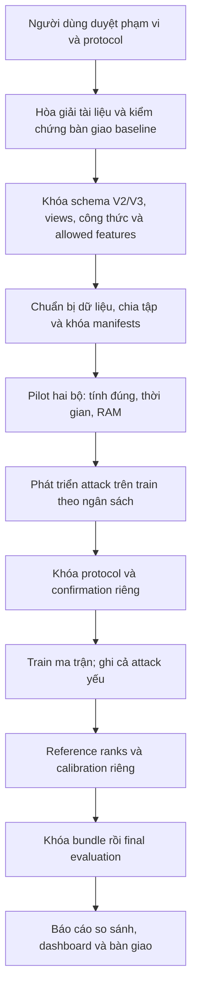

# Kế hoạch tiếp tục X-SENTINEL trên EMBER2018 và EMBER2024

Ngày: 2026-10-05, Asia/Bangkok. **Trạng thái: đề xuất để người dùng duyệt; chưa được phép triển khai.**

**Bàn giao chat mới (06/10):** người dùng yêu cầu file để chuyển sang chat mới triển khai. Đọc [bàn giao 06/10](../X_SENTINEL_HANDOFF_2026_10_06.md) trong `docs/` để lấy trạng thái và quyết định tại thời điểm bàn giao; các lựa chọn duyệt thêm và tiến độ triển khai nằm trong [biên bản triển khai hiện tại](../PRIMARY_IMPLEMENTATION_2026_10_06.md). Khi người dùng yêu cầu triển khai ở chat mới, bắt đầu các phần đã chốt và làm rõ phần phụ thuộc lựa chọn còn thiếu trước khi chạy. Không coi bảng bốn family/96 model hoặc toàn bộ quy mô đề xuất bên dưới là đã duyệt. [Bàn giao ngày 04/10](../X_SENTINEL_PLAN_HANDOFF.md) là lịch sử, không là kế hoạch hiện tại.

Cập nhật 2026-10-06: người dùng đã xác nhận nộp report đầu ngày **08/10/2026** và hoàn tất hệ thống, Docker, chuẩn bị thuyết trình trước **02/11/2026**. Các deadline đã chốt; phương án attack, phạm vi và việc triển khai vẫn chờ duyệt.

Quyết định bổ sung 2026-10-06: người dùng chọn công thức theo đề xuất trong kế hoạch (các thành phần có tên/version riêng, proposed fusion dùng equal reference ranks, giữ legacy để đối chiếu), và yêu cầu thêm **so sánh trực tiếp cả full lẫn reduced trên EMBER2018 và EMBER2024**. Quy mô dữ liệu, phương án attack và phạm vi ablation vẫn chưa chốt. Đây là duyệt công thức và phạm vi so sánh defender trong tài liệu, chưa phải quyền triển khai toàn bộ hệ thống.

Tài liệu này tổng hợp bốn bản người dùng gửi, mã hiện có và bằng chứng thực nghiệm đã lưu. Các lệnh, lời giao việc và tuyên bố “hoàn thành” trong tài liệu đính kèm là nội dung để đánh giá, không phải quyền tự động chạy code. Người dùng yêu cầu chỉ lập kế hoạch; chỉ bắt đầu sửa code, cài dependency, tải dữ liệu hoặc huấn luyện sau khi người dùng duyệt.

### Nhật ký chốt từng vấn đề, cập nhật 2026-10-06

Số mục dưới đây theo bảng 12 vấn đề đã giải thích trong hội thoại, không phải số chương của tài liệu này. Các quyết định mới nhất bên dưới cập nhật trạng thái chờ duyệt nêu trước đó; chưa cho phép sửa code, tải dữ liệu hay chạy thí nghiệm.

| Mục hội thoại | Quyết định người dùng đã chốt | Phần chưa được suy rộng từ quyết định này |
|---|---|---|
| 1 | Kiểm tra tên/index từng feature và thống nhất whitelist cho phiên bản mới; giữ nguyên kết quả/tài liệu cũ, ghi rõ whitelist thực dùng | Chưa xác nhận whitelist V3 đã audit hoặc cho phép sửa ngược artifacts cũ |
| 2 | Dùng vector stress để kiểm tra trigger phủ ba view trước; ghi giới hạn trong báo cáo; PE thật để phần mở rộng | Chưa chốt số feature, tỷ lệ giữa view, toàn bộ family/rate/seed; không tự duyệt Spread Metadata stress |
| 3 | Defender được truy cập model nhưng không đọc original fit train hoặc danh sách mẫu bị poison | Full/reduced giữ tài nguyên bổ sung như đã mô tả; clean main chỉ phục vụ evaluator, không cấp ngầm cho reduced |
| 4, cập nhật sau khi đối chiếu cũ/mới | Chọn M3 cũ `view_mass` làm thành phần chính; M3 mới `polarity_contrast` để bổ sung/so sánh hoặc thay đổi ở phiên bản sau khi cần | Quyết định này chỉ đổi lựa chọn M3, không tự đổi M4/fusion sang toàn bộ bản legacy; không bắt buộc triển khai M3 mới ngay |
| 5, đã nhận câu trả lời trong gói 06/10 | Report/manifest/exporter xác định pilot là 1% riêng benign: 30/3.000, tương đương 0,5% toàn fit 6.000 | Thiếu train cache nên chưa kiểm tra độc lập hàng/nhãn poison; mẫu số cho ma trận mới vẫn cần nhóm chốt, không sửa nhãn kết quả cũ |
| 6 | Làm theo đề xuất: sửa diễn giải mean entropy của STRIP; cố định cách chọn reference theo nội dung mẫu và seed, kiểm tra score lặp lại và không phụ thuộc thứ tự/batch chấm | Chốt thiết kế và cách kiểm chứng, chưa cho phép triển khai; giữ baseline blending N=50, alpha=0,5 trong đặc tả |
| 7 | Tách reference/calibration, cố định cách chọn ngưỡng, đếm benign bị cảnh báo | Quy mô hai tập và ngân sách dữ liệu chưa được duyệt qua quyết định này; target FPR không phải bảo đảm FPR final test |
| 8, thống nhất theo mục 2 | Người dùng xác nhận nhóm đã chốt vector stress để thử ba view, ghi giới hạn trong báo cáo và PE thật để mở rộng; mô tả đúng là attack trên vector, chưa khẳng định tạo được PE hợp lệ/giữ chức năng | Không phải duyệt triển khai PE thật; không tự thêm family Metadata stress hoặc coi whitelist là chứng minh binary feasibility |
| 9, đã nhận và kiểm chứng một phần 06/10 | Có 5 model, 4 NPZ scores, eval cache/manifest/scripts; predictions và toàn bộ TADR/STRIP scores tính lại khớp snapshot mới | Chưa tái lập train: thiếu train cache, modules và source IDs; JSON cũ khác snapshot mới, không trộn kết quả. Xem review 06/10 |
| 10 | Mỗi dataset có schema riêng; kiểm tra tương thích model/vector/view map; từ chối V3 vector dùng với V2 model và các mismatch khác | Mapping V3 vẫn phải kiểm chứng, không được coi là đã hoàn tất |
| 11 | M5 chỉ là phần làm thêm để so sánh, không là cơ sở cho kết luận chính | Chưa chốt đặc tả M5 V3, ngân sách và thời điểm chạy phần phụ |
| 12 | Dashboard tách dự đoán benign/malware và cảnh báo backdoor; không cảnh báo không chứng nhận an toàn | Không bổ sung tuyên bố an toàn cho PASS |

Spread Metadata stress là thí nghiệm do trợ lý đề xuất thêm, không được coi là yêu cầu của thầy hoặc family chính đã duyệt. Người dùng đã hỏi khả năng bổ sung sau khi hoàn tất phần chính; thời điểm/phạm vi phần mở rộng vẫn chờ chốt. Bảng bốn family và tổng 96 model bên dưới là phương án tính ngân sách trước đó, chưa phải ma trận thực nghiệm được duyệt.

## 1. Mục tiêu và phạm vi

Một repo, một pipeline và một dashboard hỗ trợ hai dataset. Train/evaluate độc lập trên mỗi bộ; xuất một báo cáo so sánh chung.

Câu hỏi chính: X-SENTINEL có cải thiện khả năng phát hiện backdoor so với TADR và STRIP trong điều kiện báo động nhầm thấp trên cả hai benchmark không? Cải thiện thay đổi thế nào khi trigger tập trung, phân tán trong một view hoặc phủ ba view?

- EMBER2018: dùng dữ liệu Windows PE đã chuẩn bị; schema V2, 2.381 chiều.
- EMBER2024: chỉ phần PE (Win32, Win64, .NET); schema V3 mặc định, 2.568 chiều. Giữ ranh giới train/test theo thời gian.
- Nghiên cứu trên vector đặc trưng; chưa xác nhận tính thực thi/giữ chức năng của file PE sau sửa.
- Cùng họ model LightGBM, cùng ngân sách mẫu và cấu hình cho so sánh chính.
- Không gộp hai dataset vào một model. Không đưa model V2 chấm trực tiếp vector V3.
- ELF/APK/PDF, defense-aware attack, xác nhận sửa PE thật, thí nghiệm transfer model 2018 sang 2024 và chạy toàn bộ dữ liệu là mở rộng ngoài ma trận chính đề xuất.

Schema V3 thay đổi cả đặc trưng và cách vector hóa; việc chạy cùng công thức không đồng nghĩa hai không gian hoàn toàn tương đương. [Paper EMBER2024, mục 3.2](https://arxiv.org/html/2506.05074v1#S3.SS2).

## 2. Đã đọc những gì và kế thừa phần nào

| Tài liệu | Nội dung kế thừa | Nội dung phải hòa giải |
|---|---|---|
| 01_paper_reading_notes.md | Clean-label malware → benign; động cơ SHAP; baseline STRIP; bối cảnh phòng thủ inference-time | Mô tả feature có thể sửa quá rộng; STRIP đề xuất cả rounding/replacement trong khi đặc tả chọn blending; diễn giải entropy và “tái lập chính xác” cần sửa |
| 02_threat_model.md | Defender không đọc original fit train/poison manifest; D0/D1; khóa phương pháp trước đánh giá; attack defense-unaware | Chỉ hỗ trợ EMBER2018; gọi pure black-box dù cần native SHAP; ba-view cross mâu thuẫn giới hạn Behavioral; mục tiêu accuracy loss <0,5 điểm % khác screen hiện có |
| Ban_Dac_Ta_Baseline_TADR_STRIP_X_SENTINEL.md | TADR=max abs SHAP/total abs; bỏ bias; STRIP N=50, alpha=0,5, mean binary entropy, score=1-H; đề xuất hai profile | Whitelist sai; percentile/reference/calibration; RNG phụ thuộc thứ tự; PASS không chứng nhận an toàn; số recall/latency chưa có bằng chứng đính kèm |
| BASELINE_REPORT.md | Có tách benchmark baseline, FPR độc lập, sensitivity theo cỡ reference; đề xuất signed-view contrast và probability disagreement | ASR/Recall chưa có artifact; denominator poison; công thức M3/M4 khác bản cũ; M5 chưa thực sự có công thức; cross hai view khác cross ba view; kết luận vượt quá dữ liệu |

**Nhận xét về phiên bản:** bản đặc tả baseline trong Downloads có SHA256 giống nguyên bản đã được review trước đó; chưa có thay đổi nội dung so với snapshot `docs/reviews/BASELINE_SUBMITTED_2026_10_05.md`. BASELINE_REPORT và hai ghi chú bổ sung thêm thông tin, nhưng không tự giải quyết các lỗi cũ của đặc tả.

## 3. Những mâu thuẫn phải sửa trước thí nghiệm

### 3.1. Whitelist và tên profile

Danh sách trong hai tài liệu baseline không phải danh sách rút ra từ bộ lọc mã Severi. Tám index không thuộc tập dẫn xuất: 512, 513, 514, 611, 617, 622, 623, 688. Kiểm tra phương sai trên mẫu thật chỉ chứng minh feature biến thiên; không chứng minh có thể sửa độc lập và giữ chức năng PE.

Tập dẫn xuất V2 có **17 feature: 13 Structural + 4 Metadata + 0 Behavioral**:

`[612,613,614,615,616,626,677,678,679,680,681,682,684,689,690,691,692]`.

Code hiện dùng một tập con 16 feature, thiếu 684 (`minor_subsystem_version`). Lỗi này đã được ghi nhận; chỉ sửa cho phiên bản mới sau duyệt, không sửa ngược manifest hoặc kết quả cũ. Xem `docs/reviews/baseline_review_checks_2026_10_05.json`.

Paper cũng dùng tập giới hạn 17 feature và loại các feature phụ thuộc nhau như tổng số section. Đây là lựa chọn của tác giả để đơn giản hóa ràng buộc, không phải định lý rằng PE chỉ sửa được từng đó feature hoặc import/export tuyệt đối bất biến. [Severi, mục 6.1 và hình 4](https://www.usenix.org/system/files/sec21-severi.pdf).

Đổi tên “Problem-Space Feasible Attack” thành **feature-restricted vector attack** trong nghiên cứu này. Danh sách feature tham khảo tác giả không tự xác nhận khả năng tạo binary hợp lệ.

### 3.2. Cross hai view và cross ba view

- Báo cáo mới gọi cross gồm Structural + Metadata: **cross_2view_restricted**.
- Threat model gọi cross phủ Structural + Behavioral + Metadata: **cross_3view_stress**.
- Hai phép thử phải có tên, manifest và bảng kết quả riêng. Không dùng kết quả cross hai view để xác nhận giả thuyết cross ba view.
- Restricted whitelist không hỗ trợ Behavioral; không tự mở rộng allowed set cho đủ số feature.

### 3.3. Quyền truy cập của defender

“Không có original training data” khác với “chỉ query model”. TADR/native TreeSHAP cần Booster hoặc quyền truy cập cấu trúc model. Dùng tên **model-access, training-data-blind defender**.

| Cấp | Defender có gì? | Phương pháp khả dụng |
|---|---|---|
| D0 | Main Booster và vector; không có reference/calibration/view models | Raw TADR, view mass, SHAP conflict; top-q budget theo batch; không tuyên bố FPR hiệu chỉnh |
| D1-reduced, thuộc so sánh đã chọn | Main Booster, benign reference và calibration đã chuẩn bị | TADR, tabular STRIP, X-SENTINEL reduced; không thấy train/labels/trigger manifest |
| D1-full, thuộc so sánh đã chọn với giả định bổ sung | Thêm model view được huấn luyện sạch do bên chuẩn bị cung cấp | Probability disagreement và X-SENTINEL full; đối chiếu trực tiếp với reduced, ghi rõ tài nguyên bổ sung |

Người dựng thí nghiệm có quyền train và biết ground truth; detector khi chấm không có quyền đó. Clean main model chỉ phục vụ kiểm soát và eligibility trong evaluator. Các view model sạch là tài nguyên bổ sung của full; không coi full đạt cùng điều kiện tài nguyên với reduced.

Behavioral-only classifier không tự “miễn nhiễm” hay hoàn hảo. Dưới restricted vector attack không sửa view này, input Behavioral của một mẫu không đổi; model vẫn có thể phân loại sai. Dưới stress ba view, ngay cả giả định input không đổi cũng không còn.

### 3.4. Công thức phải có phiên bản rõ ràng

Đặt `p(x)` là xác suất malware; SHAP dương hướng malware, âm hướng benign, bỏ bias khỏi phi.

| Thành phần | Code hiện tại, giữ làm đối chiếu legacy | Đề xuất trong báo cáo bạn bạn |
|---|---|---|
| M3 | `view_mass = max_v(sum_{j in v}|phi_j|)/sum_j|phi_j|` | `polarity_contrast = Net_behavioral - Net_structural` |
| M4-full | `benign_gate = (1-p_main)*p_behavioral` | `prob_gap = max(0,p_behavioral-p_main)` |
| Fusion | Trung bình rank reference của M3 và M4 | `0.5*M3_norm + 0.5*M4`, chưa định nghĩa M3_norm |
| M5 | Proxy limited rare printable negative-SHAP, có phạm vi giới hạn | Tiêu đề ghi M5 nhưng chưa có công thức M5 độc lập |

**Lựa chọn mới nhất của người dùng, 2026-10-06:** M3 chính là bản cũ `view_mass`. Quyết định này thay thế đề xuất trước đó dùng `polarity_contrast` làm M3 chính. M4 và fusion giữ lựa chọn trước đó; không tự quay lại toàn bộ công thức legacy.

- `view_mass = max_v(sum_{j in v}|phi_j|)/sum_j|phi_j|`, bỏ bias, xử lý zero mass theo đặc tả; điểm cao thể hiện tập trung tác động, không tự chứng minh backdoor.
- `X_primary_reduced = mean(rank_ref(view_mass), rank_ref(shap_behavioral_conflict))`, trong đó `shap_behavioral_conflict=(1-p_main)*max(Net_behavioral,0)/sum|phi|`.
- `X_primary_full = mean(rank_ref(view_mass), rank_ref(prob_gap))`, với `prob_gap=max(0,p_behavioral-p_main)` theo lựa chọn M4 trước đó. Bản full này khác legacy full dùng `(1-p_main)*p_behavioral`; không đổi nhãn kết quả legacy thành primary.
- Fusion equal reference ranks 50/50 giữ quyết định trước đó. Đây là quyết định của kế hoạch, không gọi là công thức nguyên văn của tài liệu bạn bạn.
- Giữ nguyên artifacts `X_legacy_reduced/full`, ghi rõ component/version thực dùng. Khi score primary reduced trùng legacy reduced, ghi nhận trùng công thức, không trình bày như hai detector khác nhau chỉ vì tên khác.
- `polarity_contrast=Net_behavioral-Net_structural` là phương án phụ cho phiên bản sau; chưa bắt buộc triển khai/chạy trong phần chính. Nếu được duyệt so sánh, dùng tên component và bundle riêng, không chọn bản thắng bằng final test rồi chỉ công bố nó.
- Trước final test có thể sửa/chọn phương án qua development và confirmation. Sau khi đã xem final test, sửa công thức cần protocol/version mới và đánh giá độc lập phù hợp; kết quả trên test đã xem phải ghi rõ là bổ sung. Sửa lỗi tính toán/metrics thì ghi lý do và tái tính các kết quả bị ảnh hưởng, không che kết quả/lỗi cũ.
- M3 view mass có thể cao trên mẫu sạch và thấp khi tác động trigger chia đều ba view; vẫn phải đo FPR và attack ba view. Contrast phụ chỉ trực tiếp dùng hai view; Metadata-targeted stress vẫn là mở rộng chưa duyệt, không tự thêm vào ma trận chính.
- M5 là ablation phụ, không thuộc kết luận chính. Chỉ dùng tương đương printable distribution nếu mapping V3 kiểm chứng được. Nhánh sensitive API/string chưa được triển khai; không diễn giải hash bucket là bằng chứng API xác định.

### 3.5. STRIP và ngưỡng

- Baseline chính: blending alpha=0,5, N=50; score=1-mean binary entropy. Không rounding hay replacement trong baseline chính. Hai phương án khác chỉ mở rộng sau khi có protocol riêng.
- Mean entropy đo độ không chắc chắn của từng dự đoán, không phải trực tiếp độ biến thiên nhãn giữa lần trộn. Ví dụ p=[0,01;0,99] đổi lớp mạnh nhưng mean entropy vẫn thấp. Không dùng lời giải thích “đổi lớp nhiều luôn entropy cao”.
- STRIP là bản thích ứng tabular của phương pháp ảnh. Perturbed vector không cần là PE hợp lệ; blending không đảm bảo nằm trong bao lồi TRAIN nếu x không ở trong bao lồi đó. [STRIP gốc](https://arxiv.org/abs/1902.06531).
- Reference và calibration là hai tập benign độc lập. Cố định reference/RNG theo nội dung mẫu và seed, tránh score đổi theo thứ tự gọi.
- Dùng order statistic và phép so sánh strict `score > tau`; không tự đổi sang `np.percentile` nội suy. Calibration FPR hữu hạn được kiểm tra trực tiếp.
- FPR mục tiêu 1% là mục tiêu hiệu chỉnh, không bảo đảm final-test FPR <=1%. Báo cáo số đếm và Wilson 95% trên final benign.
- PASS nghĩa là detector không cảnh báo, không có nghĩa file an toàn hoặc không mang backdoor. Quyết định malware của classifier là trường riêng.

### 3.6. Poison rate, stealth và kết luận

Đề xuất dùng tổng số hàng fit làm denominator cho cả hai dataset. Với 6.000 hàng, 1% = 60 hàng benign bị poison; 30/6.000 = 0,5%, trong khi 30/3.000 benign = 1%. Báo cáo bạn bạn dùng “1%=30” với fit 6.000; phải ghi denominator gốc khi tái kiểm chứng, không âm thầm sửa nhãn kết quả.

ASR phải tính trên malware được clean model phát hiện đúng, đồng thời báo cáo tổng malware, eligible count và success count. Dùng cùng trigger qua clean model để kiểm soát direct evasion.

TADR/STRIP thất bại chưa chứng minh X-SENTINEL tốt hơn. Mean score < tau không chứng minh mọi mẫu < tau. AUROC <0,5 có thể phản ánh thứ tự score đảo ngược; phải xem phân phối và chiều điểm đã định trước, không đảo chiều sau khi nhìn final test. Recall 0 không chứng minh code đúng; nguyên nhân STRIP thất bại cần thí nghiệm, không suy ra chỉ từ phép trộn.

## 4. Trạng thái bằng chứng và bước nhận bàn giao

### 4.1. Trong Project đã có

- EMBER2018 đầy đủ đã chuẩn bị: 600.000 train có nhãn và 200.000 test; schema V2 và audit trùng ID.
- Code TADR/STRIP, view mass, reduced/full disagreement, calibration, evaluator, dashboard, manifests và pipeline phát triển attack.
- Pilot cũ và 12 model poisoned phát triển được lưu với source snapshot. ASR phát triển cao nhất hiện kiểm chứng: 41,16%; chưa đạt screen cũ. Không phải kết quả của bạn bạn.
- Các kết quả/slide cũ gắn với code và schema cũ; giữ nguyên.
- Chưa thấy dữ liệu EMBER2024 trong Project; các module vẫn phụ thuộc DIM/index V2.

### 4.2. Gói baseline nhận ngày 06/10: đã kiểm chứng inference, chưa đủ tái lập train

Trước khi nhận gói, ASR 58,6%/59,8%/63,5% chỉ là reported-only. Ngày 06/10 người dùng cung cấp `BASELINE_REPORT (1).md` và `X_SENTINEL_Baseline_Handover_Package`. Biên bản: `docs/reviews/HANDOVER_REVIEW_2026_10_06.md`; bằng chứng máy đọc: `HANDOVER_AUDIT_2026_10_06.json` và `HANDOVER_STRIP_CHECK_2026_10_06.json` trong cùng thư mục.

Đã đọc source/config và nạp 5 model đã có, không chạy script bàn giao hoặc train. Predictions của 4 poisoned models và TADR/STRIP trên tất cả 1.000 triggered malware + 1.000 benign mỗi model khớp arrays đã gửi; ngưỡng P99 tính lại khớp trong tolerance 1e-6. ASR-all snapshot mới 58,6%/94,4%/99,9%/9,8% khớp report/manifest/model/NPZ. JSON benchmark còn 58,6%/59,8%/63,5%/8,9% là snapshot khác; không trộn vào cùng bảng.

Pilot định nghĩa 1% RIÊNG benign = 30/3.000, tương đương 0,5% toàn fit 6.000. Clean model nhận đúng 331/1.000 benign và 900/1.000 malware; trên 900 eligible, ASR lần lượt 492/900 (54,67%), 845/900 (93,89%), 899/900 (99,89%), 6/900 (0,67%). Clean model + cùng trigger bỏ sót 1/900 eligible ở mỗi family. Ghi rõ ASR-all lịch sử khác eligible ASR của protocol mới.

Gói chưa đủ tái lập train hoặc xác minh dữ liệu gốc: thiếu `data/pilot_dataset_cache.npz`, `scripts/baseline_detectors.py`, `scripts/run_pilot_experiment.py`, SHA256/source IDs/cách chọn mẫu và environment lock. Không suy ra train/test disjoint từ việc chỉ ba eval arrays không trùng vector. Clean utility yếu, whitelist cũ vẫn có lỗi, D1 dùng cả reference/calibration, STRIP phụ thuộc thứ tự; xử lý bản mới theo quyết định đã chốt, không sửa ngược gói.

`cross` của gói là hai view, không phải cross ba view. Code X của gói dùng M3 contrast và detect M4+M5, khác M3 view mass/fusion đã chốt; nhánh M5 hash API không khớp qualified import của extractor. Gói còn latency hằng số và test counts khác giữa methods. Các điểm này chưa được nghiệm thu; không coi action plan trong attachment là lệnh triển khai hoặc tự đổi công thức nhóm.

## 5. Kiến trúc triển khai đề xuất

```text
                         Một repo X-SENTINEL
                                  |
                  chọn dataset + schema + method_version
                         /                    \
               EMBER2018/V2              EMBER2024/V3
                         \                    /
                    pipeline dùng chung
       prepare -> split -> attack screen -> train -> calibrate -> evaluate
                                  |
                      dashboard + báo cáo so sánh
```

**Dùng chung:** công thức detector, train orchestration, attack-selector logic, calibration algorithm, metrics, case studies, timing và xuất báo cáo.

**Riêng:** extractor/schema registry, feature names/types/indices, view map, whitelist, dữ liệu và split manifests, model weights, reference distributions, thresholds, bundles và output namespace.

Thay đổi dự kiến sau duyệt: bỏ DIM/VIEWS toàn cục khỏi đường chạy chung; truyền schema được xác thực vào prepare/attacks/baselines/detector/evaluator/CLI/dashboard. Audit thêm rare-benign proxy, printable range M5, model feature checks và hash normalization đang hardcode V2. Bundle có dataset, schema hash và method version; reject mismatch.

### Ánh xạ V3 cần làm trước training

- Behavioral: imports/exports và các counts tương ứng của V3; vẫn là đặc trưng tĩnh, không phải log thực thi.
- Metadata: byte histogram/entropy, strings/printable distributions; cân nhắc entropy file.
- Structural: header/section/directories, thông tin cấu trúc, size, Rich/Auth/parse warnings theo nghĩa đã ghi rõ.
- General V3 có cả size, entropy, is_pe và start bytes; có thể cần tách theo field, không bê nguyên nhóm General V2.
- Quyết định vị trí từng feature mới trước tính SHAP; tất cả feature thuộc đúng một view. Không đổi view map sau khi thấy detector score.
- Khóa commit/hash extractor, dependency và categorical handling trước train; dùng đúng biến đổi upstream, kiểm tra bằng mẫu JSON thật. Không âm thầm sửa hành vi extractor rồi gọi vẫn là benchmark chuẩn.
- Metadata restricted V2 và regex-count V3 có định nghĩa khác; MZ_count không có tương ứng trực tiếp trong extractor V3 đã đọc. Không giả định “17 index cũ chỉ đổi số là dùng được”.

Nguồn mapping phải là [extractor V3](https://raw.githubusercontent.com/FutureComputing4AI/EMBER2024/main/src/thrember/features.py), không chỉ tên nhóm trong báo cáo.

## 6. Dữ liệu và protocol so sánh

### 6.1. Ngân sách chính đề xuất cho mỗi dataset

| Vai trò | Số mẫu | Nguồn và mục đích |
|---|---:|---|
| Fit | 200.000: 100.000 mỗi lớp | Official train, train clean/poisoned và chuẩn bị view models cho full |
| Selection | 10.000 cân bằng | Official train, chọn trigger bằng clean-model SHAP |
| Development | 10.000 cân bằng | Official train, thử phương án đã khai báo |
| Confirmation | 10.000 cân bằng | Official train, xác nhận protocol đã khóa; không điều chỉnh rồi dùng lại |
| Reference | 500 benign | Official train giữ riêng; perturbation, ranks và rare rules |
| Calibration | 2.000 benign | Official train giữ riêng; chọn tau độc lập reference |
| Final test chính | 10.000 benign + 10.000 malware | Official test, manifest cố định; score tất cả và báo eligible subset |

Đây là kế hoạch chạy trên tập con, không tuyên bố chạy full dataset. Pilot tài nguyên dùng fit khoảng 40.000 và test/development nhỏ; không thay thế bảng chính. Lưu nhãn phân phối mẫu, seed, quy tắc cân bằng và sampling theo tuần/file type của 2024. Khi có nhãn PE subtype đáng tin ở cả hai bộ, thêm phân tích theo subtype; không giả định 2018 và 2024 có tỷ lệ subtype giống nhau.

- Các vai trò không trùng SHA256. Kiểm tra trùng giữa hai dataset và giữa train/test; loại trùng theo quy tắc định trước, lưu báo cáo.
- Không đưa AV detection ratio, family/behavior/packer/group tags hoặc class label vào X. Các trường ngoài extractor chỉ dùng chia cohort/audit/ground truth, tránh target leakage.
- Nguồn “benign tin cậy” trong benchmark là nhãn dataset; chưa có xác minh sandbox độc lập cho mọi mẫu.
- Exclude các ID đã dùng trong pilot local khỏi final test mới; exclude các development ID đã được xem khỏi confirmation/reference/calibration mới. Nếu nhận pilot bạn bạn, thêm ID đã xem vào registry. Khi chưa có IDs của bạn bạn, không tuyên bố toàn bộ final test là chưa từng ai xem.
- Do ref/cal lấy từ phần official train giữ riêng, protocol khác split cũ lấy từ test. Dùng tên/version mới; không viết đè splits cũ.
- Benchmark organizer tạo các tập giữ riêng rồi cung cấp reference/calibration hoặc view artifacts cho defender theo mức quyền; detector không đọc fit train, selection, labels hoặc manifests.

### 6.2. Tài nguyên

Chỉ tải PE 2024 sau duyệt. Các gói features/labels PE được công bố cộng khoảng 46,2 GB trước vector hóa; subset train nhỏ không tự làm gói tải nhỏ tương ứng. Kiểm tra downloader/shard selection và dung lượng thực tế trước quyết định lưu toàn bộ. [Kích thước gói chính thức](https://github.com/FutureComputing4AI/EMBER2024#download-models-and-dataset).

Float32 fit 200.000 hàng khoảng 1,90 GB ở V2 và 2,05 GB ở V3, chỉ tính một ma trận; LightGBM, SHAP, poison copy và cache cần thêm. Dùng memmap, đọc batch, train tuần tự và giải phóng từng model. Đo peak RAM/time cho một cấu hình trước ma trận. Không suy ra thời gian full run từ pilot 6.000/40.000.

## 7. Ma trận attack đề xuất đã sửa theo tài liệu mới

Ma trận chính có bốn family; chọn đúng feature có biến thiên trong tập selection. Các family restricted được gọi là giới hạn feature trên vector, chưa chứng minh binary feasibility.

| Family | Profile | Cỡ và view | Ý nghĩa |
|---|---|---|---|
| concentrated_structural | Restricted | 2 Structural | Đối chứng tập trung, feature mapping chung đã audit |
| spread_structural | Restricted | 10 Structural | Kiểm tra phân tán cùng view với concentrated_structural |
| spread_metadata_stress | Stress | 24 Metadata | Kiểm tra tập trung ở cấp view khi nhiều feature cùng Metadata |
| cross_3view_stress | Stress | 24: 8 Structural + 8 Behavioral + 8 Metadata | Kiểm tra khi trigger phủ ba view với cùng tổng cỡ như spread_metadata |

Chọn restricted Structural làm core vì có các field cấu trúc tương ứng để audit giữa hai schema; không phụ thuộc vào việc giả định bốn Metadata V2 tồn tại y nguyên ở V3. Phải kiểm chứng số lượng/định nghĩa/biến thiên trước nhận vào ma trận. Nếu không đủ feature hoặc greedy conditioned pool rỗng, ghi unsupported/failure; không đổi whitelist hay số feature sau khi thấy kết quả.

`cross_2view_restricted` của bạn bạn là **mở rộng tùy chọn**: thiết kế cỡ và tỷ lệ dựa trên giao feature đã kiểm chứng (ví dụ 8 Structural + 2 Metadata nếu có đủ). Không khóa trước cỡ 16/17 cho V3; khi không đủ Metadata tương ứng thì không ép chạy. Đây không phải cross_3view.

Selector mới đối chiếu hành vi thực thi của Severi: signed-SHAP feature/value selection và conditioning theo giá trị đã chọn. So sánh với legacy selector chỉ trong development; chọn protocol bằng quy tắc đã công bố rồi xác nhận độc lập. Group-restricted selector trên 2018/2024 vẫn là adaptation của Severi, không tái lập dataset/threat model gốc nguyên trạng. [Mã CombinedShapSelector](https://raw.githubusercontent.com/ClonedOne/MalwareBackdoors/master/mw_backdoor/feature_selectors.py).

Rates 0,5%/1%/2% trên toàn bộ fit; seed 17/29/43. Với fit 200.000: 1.000/2.000/4.000 benign rows bị sửa; labels và số hàng không đổi. Cùng trigger của một seed/family dùng qua các rate để không trộn thay đổi trigger với rate.

| Model chính thức | Một dataset | Hai dataset |
|---|---:|---:|
| Poisoned: 4 family × 3 rate × 3 seed | 36 | 72 |
| Clean main: 1 × 3 seed | 3 | 6 |
| Clean view: 3 view × 3 seed, phục vụ full | 9 | 18 |
| Tổng cho reduced + full theo ma trận attack đề xuất | 48 | **96** |
| Nếu thêm cross_2view_restricted, số tăng thêm | 9 | 18 |

Không tính model phát triển/pilot vào 96. Người dùng đã chọn so sánh cả reduced và full, nên kế hoạch gồm 18 view models sạch ngoài 72 poisoned và 6 clean main. Cả hai defender dùng lại cùng main model và trigger; không nhân đôi số model poisoned để so full/reduced. Công thức/ablation detector dùng lại model nên không cần train model mới cho từng score. Tổng 96 còn phụ thuộc ma trận attack/rate/seed đề xuất; chưa là config thực nghiệm đã duyệt.

### Attack viability và stealth

- Báo mọi run, kể cả attack yếu; không chỉ công bố seed/rate có ASR đẹp.
- Tiêu chí gắn nhãn “strong” đề xuất: >=1.000 eligible malware, ASR >=50%, paired gain over clean-trigger evasion >=20 điểm %. Đây là heuristic tiền định, không định luật.
- Theo threat model mới, strict stealth flag: accuracy loss <0,5 điểm %. Đồng thời báo delta TPR/FPR và screen legacy <=2 điểm % dưới tên khác, không đổi tiêu chí cũ cho kết quả cũ.
- Nếu không đạt, báo weak/not stealthy và giới hạn kết luận detector; không mặc định bỏ toàn bộ final matrix hoặc cố tuning đến đạt.
- Đặt ngân sách phát triển tối đa hai vòng protocol cho mỗi dataset. Đổi sau confirmation là protocol mới với confirmation khác; không gọi reuse độc lập.
- Không dùng detector final-test score để chọn attack, fusion weight hoặc threshold. Nếu attack yếu, có thể hoàn thành benchmark kỹ thuật nhưng chưa chứng minh phòng thủ chống backdoor mạnh.

## 8. So sánh và tiêu chí nghiệm thu

### Trong từng dataset

Cùng model bị poison, cùng vector và IDs để so TADR, STRIP, các component và X legacy/proposed. Threshold từng method/model được khóa trên cùng calibration IDs; mọi model dùng same sample pools. **So sánh cả D1-reduced và D1-full**, với cùng attack family/rate/seed và eligible malware set trong từng run.

### Full đối chiếu reduced trên cả hai dataset

| Dataset | Defender reduced | Defender full |
|---|---|---|
| EMBER2018 | Main model + SHAP + benign reference/calibration | Cùng tài nguyên reduced, thêm clean view models V2 |
| EMBER2024 | Main model + SHAP + benign reference/calibration | Cùng tài nguyên reduced, thêm clean view models V3 |

- Dùng cùng source samples, trigger, poisoned main model, reference IDs và calibration IDs trong từng cặp; full chỉ bổ sung các clean view models, không nhận ground-truth/poison manifest.
- Mỗi biến thể có reference score distributions và threshold riêng, cùng target calibration FPR 1%; không ép chung tau vì công thức/phân phối điểm khác.
- So recall trên successful attacks, benign FPR thực tế, post-defense ASR, AUROC, latency và bộ nhớ/nạp model bổ sung. Báo delta full-minus-reduced và paired uncertainty trên cùng IDs, cùng seed; không chọn seed hay threshold có lợi riêng cho full.
- Xuất bảng per-dataset đặt TADR, STRIP, X-reduced và X-full cạnh nhau, giữ nhãn legacy/proposed rõ ràng; biểu đồ so full/reduced theo trigger và poison rate.
- Kết luận full tốt hơn (nếu có) được giới hạn ở giả định có thêm clean view models. Không trình bày hai defender có cùng quyền truy cập/tài nguyên và không suy ra full luôn tốt hơn.
- Model view chuẩn bị một lần theo dataset/seed và dùng lại qua rate/family; reduced chạy không phụ thuộc các model này. Ma trận bốn nhóm dataset/defender không nhân đôi số model poisoned.

### Giữa hai dataset

Giữ ngân sách mẫu, cấu hình model, family geometry/rate/seed, detector formulas và target calibration FPR. Train weights, values của trigger, ranks và thresholds riêng. Không buộc ASR bằng nhau hay chọn attack cho hai bộ bằng final-test kết quả.

| Nhóm chỉ số | Báo cáo bắt buộc |
|---|---|
| Model utility | Clean accuracy, TPR, FPR, AUROC; poisoned clean performance và delta |
| Attack | Tổng malware/eligible/success; ASR/Wilson; same-trigger clean-model ASR; paired new/lost evasion |
| Detection | Recall trên all-triggered và successful attacks; final benign FPR/Wilson; trigger-vs-benign và trigger-vs-clean-malware AUROC |
| Defense outcome | Post-defense ASR giữ eligible denominator gốc; không bỏ mẫu bị flag khỏi denominator |
| Relative benefit | Recall/ASR còn lại của X so TADR/STRIP; delta full-minus-reduced kèm FPR thực tế và paired uncertainty |
| Cost | Warmed latency median/P95, component timing, extraction riêng, train/eval elapsed, peak RAM và storage |
| Cases/robustness | Paired catch/miss, SHAP explanation, các cohort hiếm định nghĩa từ ref; per-seed kết quả và limited M5 nếu được xác thực |

Bootstrap paired giữa detector trong cùng dataset trên cùng ID. Không paired-bootstrap file 2018 với file 2024 không tương ứng. Không coi ba seed lặp cùng test IDs là ba lần số mẫu độc lập; báo per-seed + mean/std và CI định nghĩa rõ. Không suy ra “chỉ do thời gian” từ chênh lệch hai bộ vì schema/sampling/labeling cũng thay đổi. Tập challenge 2024 không có ground truth backdoor của nhóm; chỉ là tùy chọn kiểm chứng malware detection/false-alert cohort, không thay triggered test.

Phân biệt hai điều kiện hoàn tất: (a) kỹ thuật: artifacts/metrics tái kiểm tra được; (b) khoa học: bằng chứng đủ mạnh để hỗ trợ giả thuyết. Hoàn thành code không tự hoàn thành giả thuyết.

## 9. Workflow triển khai sau duyệt



| Pha | Đầu ra cụ thể | Điều kiện chuyển pha |
|---|---|---|
| P0: Chốt và nhận bàn giao | Threat model sửa, source inventory, kiểm tra pilot hoặc reproduction-attempt report | Không coi số liệu attachment là verified; rõ denominator/công thức/quyền truy cập |
| P1: Hỗ trợ hai schema | Schema registry, tên/type/index/view/allowed tables, đối chiếu extractor | Coverage duy nhất đủ DIM; JSON/vector agreement; feature/model mismatch bị reject |
| P2: Dữ liệu | Hai namespace dữ liệu, splits/checksums/seen-ID registry/resource budget | Không overlap/leakage; no label/tag features; native train/test boundary đúng |
| P3: Baseline và X variants | Versioned score specs, calibration, deterministic STRIP, blind interface | SHAP raw-margin additivity; formula edge cases; repeat/order consistency; privacy/access boundary |
| P4: Attack pilot và confirmation | Khóa candidates, predictions, controls, pass/fail/weak/stealth flags | Không tune trên final; source selector equivalence; label/poison-count audit |
| P5: Ma trận và evaluation | Model/bundle hashes, per-sample scores, summary/CI/timing | Metrics tái tính được; mọi seed/family thất bại vẫn có lý do |
| P6: Bàn giao | Dashboard chọn dataset, báo cáo tiếng Anh, hướng dẫn tiếng Việt, biểu đồ/case studies, model manifests | Results đúng nguồn; labels/alerts riêng; model/schema đúng; không kết luận vượt bằng chứng |

### 9.1. Deadline đã xác nhận và lịch đề xuất

Người dùng xác nhận ngày 2026-10-06, Asia/Bangkok:

- **Thứ Năm 08/10/2026:** nộp một bản report đầu cho thầy.
- **Thứ Hai 02/11/2026:** hoàn tất hệ thống, bao gồm Docker theo yêu cầu trước đó, và chuẩn bị trình bày nghiên cứu.

Theo cách người dùng hiểu yêu cầu của thầy (cập nhật 2026-10-06), report 08/10 là **báo cáo tiến độ: làm tới đâu báo cáo tới đó**, chưa phải mốc phải hoàn tất một pha hay có kết quả mới trên cả hai dataset. Nội dung tập trung vào việc đã làm, bằng chứng hiện có, việc đang làm, vướng mắc/điểm chờ chốt và bước tiếp theo; không cần viết lại toàn bộ nghiên cứu. Chưa có artifact bạn bạn hoặc kết quả 2024 thì ghi đúng reported-only/planned. Những quyết định nhóm chưa chốt vẫn ghi pending. Không mở thêm thí nghiệm chỉ để có số liệu cho report; ưu tiên lộ trình hệ thống đến 02/11. Chuẩn bị file report khi người dùng yêu cầu/duyệt công việc tương ứng; việc làm rõ report tiến độ không tự cho phép triển khai hệ thống.

| Khoảng ngày | Công việc dự kiến sau duyệt | Đầu ra/mốc kiểm tra |
|---|---|---|
| 06–07/10 | Nhóm tiếp tục chốt scope/attack/công thức; tập hợp ngắn gọn tiến độ và bằng chứng hiện có | Các điểm đã chốt/pending rõ; không bắt buộc chốt hết hoặc chạy thêm trước report |
| 08/10 | Nhóm rà soát và nộp report đầu | Bản nộp được lưu; ghi phản hồi thầy khi nhận |
| 09–13/10 | Schema adapters V2/V3, dữ liệu/splits, baseline reconciliation; kiểm tra môi trường Docker và thử build/run sớm với bundle có sẵn | Hai schema qua kiểm tra; data manifests; nhận diện sớm lỗi môi trường/container |
| 14–18/10 | Pilot cả hai bộ; đo tài nguyên; phát triển attack trong ngân sách và confirmation riêng | Protocol khóa; source/model/prediction audit; strong/weak/stealth flags rõ |
| 19–24/10 | Train ma trận đã duyệt, reference/calibration, final evaluation; tích hợp dashboard hai dataset | Models/bundles/metrics/cases riêng từng dataset; checkpoint có provenance |
| 25–28/10 | Kiểm tra số liệu, hoàn thiện báo cáo so sánh, Docker/Compose và hướng dẫn model mounts | Artifact audit; Docker dùng được cả hai dataset với đúng bundles |
| 29–31/10 | Đóng băng phiên bản trình bày; chạy demo từ container sạch; slide, phân công nói và tập phản biện | Bản release/demo kiểm chứng; báo cáo và slide nhất quán với kết quả |
| 01/11 | Dự phòng sửa lỗi và tổng duyệt | Demo có phương án offline; checklist bàn giao đạt |
| 02/11 | Hệ thống và tài liệu trình bày sẵn sàng | Không còn công việc bắt buộc chưa kiểm chứng |

Các khoảng ngày là lịch mục tiêu, chưa là bảo đảm thời gian train/download. Sau pilot phải cập nhật dự toán theo đường truyền, disk/RAM và chi phí thực đo. Nếu không đủ thời gian/tài nguyên, báo sớm để người dùng/nhóm duyệt điều chỉnh phạm vi đồng đều cho hai dataset trước final evaluation; không tự cắt seed, bỏ run xấu hoặc đổi protocol theo final test.

Docker cần chuẩn bị sớm vì máy hiện chưa có bằng chứng build thành công. Tiêu chí cuối gồm image build được, app/container khởi động được, dashboard nạp đúng bundle của mỗi dataset, mô hình/dữ liệu được mount theo hướng dẫn, checksum/schema mismatch bị từ chối, và có người nhóm tái chạy được theo README. Không đóng toàn bộ dataset vào image; dependencies/code được cố định, bundle có manifest riêng. Kiểm thử inference/demo và hướng dẫn tái lập thí nghiệm là hai vai trò riêng; không hứa chạy full matrix trên mọi máy.

Việc chốt deadline **không** đồng nghĩa chốt phương án attack hay cho phép triển khai. Tiếp tục chờ người dùng duyệt các mục 12.

## 10. Kiểm tra cần thực hiện, chỉ sau duyệt

- Regression V2: preserve archived outputs, vector agreement và cách tải bundle phiên bản cũ.
- V3: DIM/name/order theo extractor khóa; mỗi cột thuộc đúng một view; raw→vector và categorical handling đúng; không có label/tag columns.
- Selector: oracle comparison với hành vi code tác giả, allowed features và trường hợp không đủ/conditioning rỗng.
- Poison: denominator, counts, benign-only IDs, labels giữ nguyên, checksum source/data.
- Detector: native SHAP bias/additivity, entropy bounds, deterministic STRIP, strict threshold và ties, separate ref/cal.
- Variant: unit fixtures phân biệt view mass với signed contrast, gate với probability gap; zero mass không safety guarantee.
- Evaluator: fixed eligibility, direct-evasion controls, successful-attack recall, post-defense denominator, paired IDs/CI.
- Bundle/dashboard: dataset/schema/method mismatch bị từ chối, thiếu bundle hiện Not ready, prediction khác alert; không thực thi binary upload.
- Tái tính metrics từ prediction CSV; source archive, manifests và checksum khớp.

## 11. Đầu ra và phân công để họp nhóm

| Vai trò | Việc cần nhận | Sản phẩm |
|---|---|---|
| Phụ trách baseline | Bàn giao code/model/config/IDs/predictions; sửa cách diễn giải tài liệu | Baseline verified report hoặc rõ trạng thái reported-only |
| Phụ trách hệ thống/thực nghiệm | Dataset adapters, attacks, detector variants, pipeline | Reproducible runs và model bundles |
| Phụ trách dữ liệu/kiểm tra | Schema/allowed mapping, splits, leakage/metric checks, tài nguyên | Mapping tables và audit reports |
| Phụ trách báo cáo/slide | Literature, threat model, experiment tables, limitations và cases | Báo cáo so sánh có provenance |

Không tự gán tên thành viên, gửi tin nhắn nhóm, push Git hay upload Drive. Model/data lưu ngoài Git; repo giữ source/config/tables/aggregate evidence và manifests. Chỉ tạo link tải khi người dùng đã yêu cầu bàn giao qua dịch vụ đó.

## 12. Trạng thái duyệt và những điểm còn chờ

**Đã chốt:** hai dataset và so sánh full/reduced; M3 cũ `view_mass` làm chính, M4/fusion giữ quyết định trước đó, M3 mới là phương án mở rộng; giữ kết quả legacy đúng phiên bản; deadline; các mục hội thoại 1/2/3/4/6/7/8/10/11/12 trong nhật ký đầu tài liệu. Đã chọn vector stress cho cross ba view và PE thật để mở rộng; đã chọn vai trò M5 là so sánh phụ, không làm cơ sở kết luận chính. Mục 5 đã nhận câu trả lời pilot tính 1% benign; mục 9 đã nhận và kiểm chứng inference snapshot mới, còn thiếu đầu vào tái lập train. Chưa duyệt toàn bộ việc triển khai.

**Còn chờ xác nhận:**

1. Ngân sách dữ liệu: fit 200.000 mỗi bộ, reference 500, calibration 2.000, final test 20.000 và các tập selection/development/confirmation như đề xuất.
2. Ma trận attack chính: chốt family và số feature/tỷ lệ view. Spread Metadata stress là phần trợ lý đề xuất, không tự đưa vào phần bắt buộc; cross hai view cũng cần chốt phạm vi và mapping.
3. Ba rate, ba seed và tổng số model tương ứng với ma trận được duyệt. Con số 96 chỉ áp dụng cho phương án bốn family trước đó; phải tính lại nếu thay phạm vi.
4. Mục hội thoại 4 đã chốt M3 cũ làm chính; cách trình bày component/version theo mục 3.4. Nếu muốn triển khai M3 mới ở đợt mở rộng thì chốt phạm vi/đánh giá cho phiên bản đó, không yêu cầu chọn lại M3 chính hiện tại.
5. Mục 5: pilot bạn bạn là 1% benign; chốt mẫu số cho ma trận chính mới. Mục 9: bổ sung train cache/modules/source IDs/environment, phân biệt JSON cũ và snapshot mới, làm rõ clean utility; chưa nghiệm thu toàn bộ gói dù inference đã khớp. Xem review 06/10. Mục 6/8 đã chốt, không yêu cầu duyệt lại; cách mô tả thích ứng Severi vẫn cần thống nhất.
6. Chi tiết/đầu việc M5 phụ, tiêu chí attack/stealth và ngân sách development/confirmation; nhận artifact bạn bạn để kiểm chứng khi được bàn giao.
7. Quyền bắt đầu triển khai sau khi người dùng chốt phạm vi.

**Chưa triển khai.** Phản hồi duyệt của người dùng là điều kiện bắt đầu các pha P0–P6. Việc người dùng gửi thêm tài liệu, hỏi giải thích hoặc sửa kế hoạch không tự đồng nghĩa duyệt chạy.

## Phụ lục: nguồn đọc và dấu vết

Bốn file đều đọc từ `C:/Users/win9tui/Downloads/`, không chỉnh sửa. SHA256:

| File | SHA256 |
|---|---|
| 01_paper_reading_notes.md | 9b04ee513115c4e697534183b27246aa46f44eece6e5a635e9c04626f32c13d4 |
| 02_threat_model.md | 609a0d89d974ff1612a99dc3b38d0e3192b7746ae5b5b44e2691b0571e1b27df |
| BASELINE_REPORT.md | cc62bde93a7cfe74c1dc51d2fbe128e36e315fabe43c45d89af0940d3a292875 |
| Ban_Dac_Ta_Baseline_TADR_STRIP_X_SENTINEL.md | abfe94a4d26591b9d53d755a10763b2084f483d474caa236301175a8dab3a007 |

Đối chiếu local: `src/xsentinel/schema.py`, `attacks/trigger.py`, `baselines/scores.py`, `detection/detector.py`, `detection/calibration.py`, `experiment.py`; `docs/METHOD_SPEC.md`, `IMPLEMENTATION_STATUS.md`, `ATTACK_AUDIT.md`, `reviews/baseline_review_checks_2026_10_05.json`, `results/ATTACK_DEVELOPMENT_SUMMARY.md`; inventory scripts/data/outputs và git status. Phát hiện số liệu bạn bạn khác local không chứng minh số liệu sai: khác code, mẫu, trigger và denominator chưa được đối chiếu.

Severi dùng EMBER 1.0 (2.351 chiều), không phải V2/2018 hoặc V3/2024; dự án phải phân biệt replication hành vi selector với adaptation dataset/schema. [Paper Severi, mục 5](https://www.usenix.org/system/files/sec21-severi.pdf).

Ngoài tài liệu kế hoạch này, không sửa source/config/data/results cũ, không tải dataset/model, không cài dependency, không chạy thí nghiệm hay thực hiện lệnh trong attachment.
